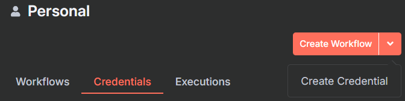
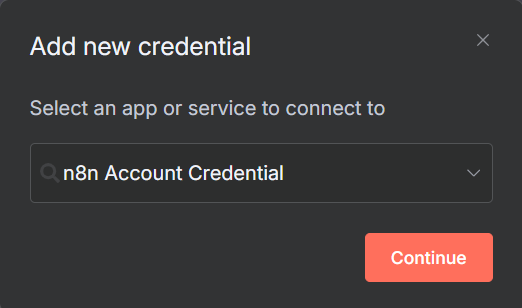
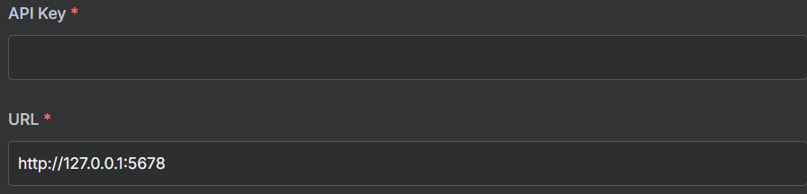
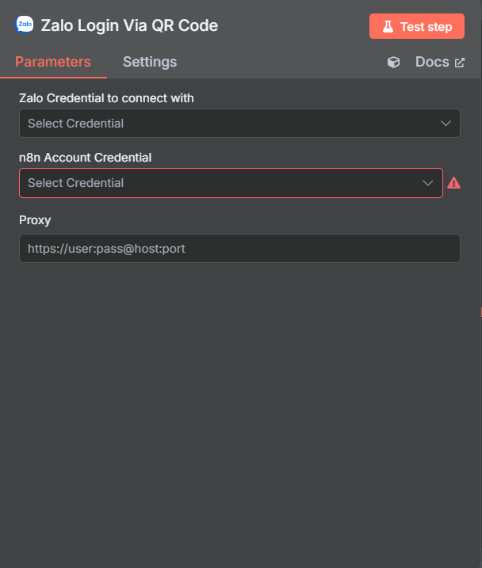

# Thiết lập credentials cho Zalo CN

Để có thể sử dụng các nodes Zalo CN bạn cần thiết lập credentials thông qua các bước sau.

## Lưu ý quan trọng

- Zalo CN Nodes không cần API key từ bên thứ ba
- Việc đăng nhập được thực hiện trực tiếp qua QR code
- Không cần đăng ký developer account

## 1. Thêm Zalo CN Credential vào n8n

### Các bước thực hiện:

1. **Mở n8n và vào phần Credentials**
   - Đăng nhập vào n8n
   - Vào phần "Credentials" trong menu chính
   - Click "Add Credential"

2. **Tìm và chọn Zalo CN Credential**
   - Tìm kiếm "Zalo" trong danh sách credentials
   - Chọn "Zalo CN API" 

3. **Thiết lập thông tin credential**
   - **Credential Name**: Đặt tên cho credential (ví dụ: "My Zalo CN Account")
   - **Description**: Mô tả tùy chọn

4. **Lưu credential**
   - Click "Save" để lưu credential
   - Credential này sẽ được sử dụng cho tất cả Zalo CN nodes

## 2. Sử dụng credential trong workflow

### Khi tạo workflow:

1. **Thêm Zalo CN Login By QR node**
   - Đây là node đầu tiên bắt buộc trong mọi workflow Zalo CN
   - Node này sẽ xử lý việc đăng nhập

2. **Chọn credential**
   - Trong mỗi Zalo CN node, chọn credential đã tạo
   - Tất cả nodes trong workflow nên sử dụng cùng một credential

3. **Đăng nhập qua QR code**
   - Chạy workflow và node Login By QR sẽ tạo QR code
   - Quét QR code bằng ứng dụng Zalo trên điện thoại
   - Xác nhận đăng nhập

## 3. Quản lý session đăng nhập

### Session tự động:
- Sau khi đăng nhập thành công, session sẽ được lưu
- Các node tiếp theo sẽ tự động sử dụng session này
- Session có thời hạn và cần đăng nhập lại khi hết hạn

### Kiểm tra trạng thái session:
- Sử dụng Zalo CN User node với operation "getUserInfo" để kiểm tra
- Nếu trả về lỗi authentication, cần đăng nhập lại

1. Ở trang chủ n8n, click vào mũi tên bên cạnh nút "Create Workflow"
2. Chọn "Create Credential" từ dropdown hiện ra

3. Trong modal tìm kiếm, sử dụng thanh tìm kiếm để tìm "n8n Zalo Account Credential"

4. Click "Continue"

5. Điền thông tin:

   - API Key: Nhập API Key đã tạo ở bước 1
   - URL: Nhập domain của n8n (ví dụ: `https://example.com`)
   - Lưu ý: URL phải bắt đầu bằng `https://` và không thêm `/api/v1` hay bất kỳ path nào khác

## 3. Tạo Zalo Credentials

Sau khi tạo n8n credentials, bạn cần tạo Zalo credentials:

1. Tạo một workflow mới hoặc vào một workflow có sẵn
2. Kéo node "Zalo Login Via QR" vào workflow
3. Click vào node để mở cấu hình
4. Trong phần "n8n Account Credential", chọn credential đã tạo ở bước 2
5. Để trống phần "Zalo Credential"
6. Click "Test Step" để tạo mã QR
7. Sử dụng Zalo trên điện thoại để quét mã QR
8. Xác nhận đăng nhập trên điện thoại

## 4. Kiểm tra Credentials

Sau khi tạo xong, bạn có thể kiểm tra credentials:

1. Quay lại trang chủ n8n
2. Vào tab "Credentials"
3. Kiểm tra xem đã có Zalo credentials chưa

## Lưu ý quan trọng

- Đảm bảo domain của bạn đã được cấu hình SSL (https)
- API Key cần được bảo mật và không chia sẻ với người khác
- Nếu gặp lỗi khi quét QR, hãy thử:
  - Kiểm tra lại URL đã nhập đúng chưa
  - Kiểm tra kết nối internet
  - Thử tạo lại credentials

